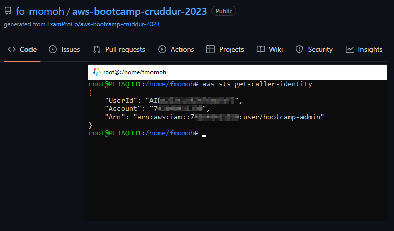

# Week 0 — Billing and Architecture

## Required Homework

## Install and verify AWS CLI

I opted out of using Gitpod or Github Codespaces because I have experience installing and working with AWS CLI locally via WSL. In this case, I installed on Alma Linux and configured it to use my admin user by default. I performed the installation using the following instructions:
```sh

curl "https://awscli.amazonaws.com/awscli-exe-linux-x86_64.zip" -o "awscliv2.zip"
unzip awscliv2.zip
sudo ./aws/install
```
Once installed I completed configuration as follows (secret and access key ID details ommitted for security reasons):

```sh
root@PF3AQHH1:/home/fmomoh# aws configure
AWS Access Key ID [None]: AKIA##############
AWS Secret Access Key [None]: ###############
Default region name [None]: us-east-1
Default output format [None]: json
```


## Homework Challenges
