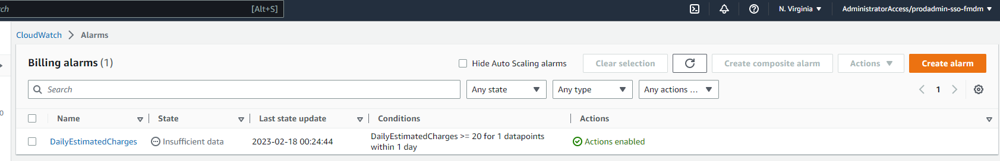
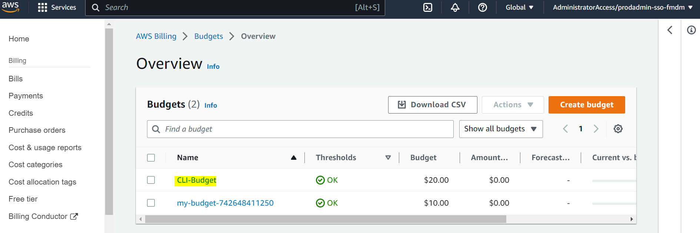

# Week 0 — Billing and Architecture

## Required Homework

### Install and verify AWS CLI

I opted out of using Gitpod or Github Codespaces because I have experience installing and working with AWS CLI locally via WSL. In this case, I installed on Alma Linux and configured it to use my admin user by default. I performed the installation using the following instructions from [here](https://docs.aws.amazon.com/cli/latest/userguide/getting-started-install.html):
```sh

curl "https://awscli.amazonaws.com/awscli-exe-linux-x86_64.zip" -o "awscliv2.zip"
unzip awscliv2.zip
sudo ./aws/install
```
Once installed I completed configuration as follows (secret and access key ID details ommitted for security reasons):

```sh
root@PF3AQHH1:/home/fmomoh# aws configure
AWS Access Key ID [None]: AKIA##############
AWS Secret Access Key [None]: ###############
Default region name [None]: us-east-1
Default output format [None]: json
```


### Create Billing Alarm

I've never actually created a billing alarm before, so this was new. I went the route of creating in CLI to alert me when I've exceeded $20 of spend. I hope to never see it in an alarming state. 


### Create a Budget
 
I already had a budget created from my organization-cli deployment, but I created this one via CLI. I set the amount to be $20 because it's something I could easily manage at this point. 


### Recreate Logical Architecture Design

Thi was my first time creating a blueprint for an application in LucidChart. It was nice seeing the various capabilities and learning about what guidelines are available to follow. Way bettter than draw.io lol.


[Link to my LucidChart Diagram](https://lucid.app/lucidchart/e9768214-e7ec-4a6f-baa6-153897a2f38c/edit?viewport_loc=-180%2C97%2C2909%2C1495%2C0_0&invitationId=inv_dfcfa332-06dd-40e0-b2b0-ce8e2c3ebded)

## Homework Challenges

### Eventbridge Hookup to AWS Health Dashboard

I happened to find some documentation for this on the AWS website. I went the click-ops route and followed these instructions [here](https://docs.aws.amazon.com/health/latest/ug/cloudwatch-events-health.html#creating-event-bridge-events-rule-for-aws-health).


### Architectural diagram of CI/CD logical pipeline

Took a little while, but I modeled this diagram off of Adrian Cantrill's diagram for one of his labs. I spent a little time trying to understand the flow of data from source control to the deployed application. Looking forward to seeing how we put this together. 


