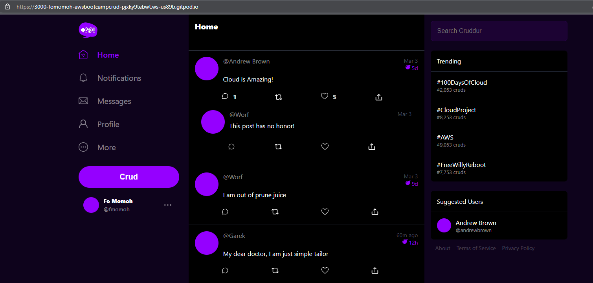
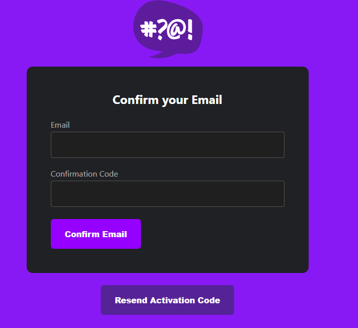
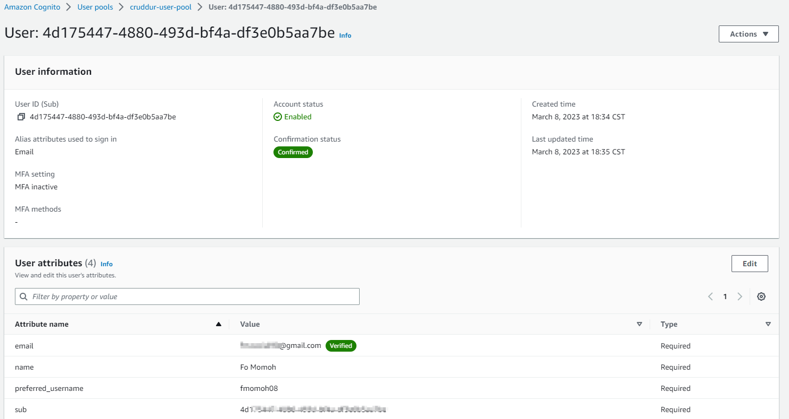
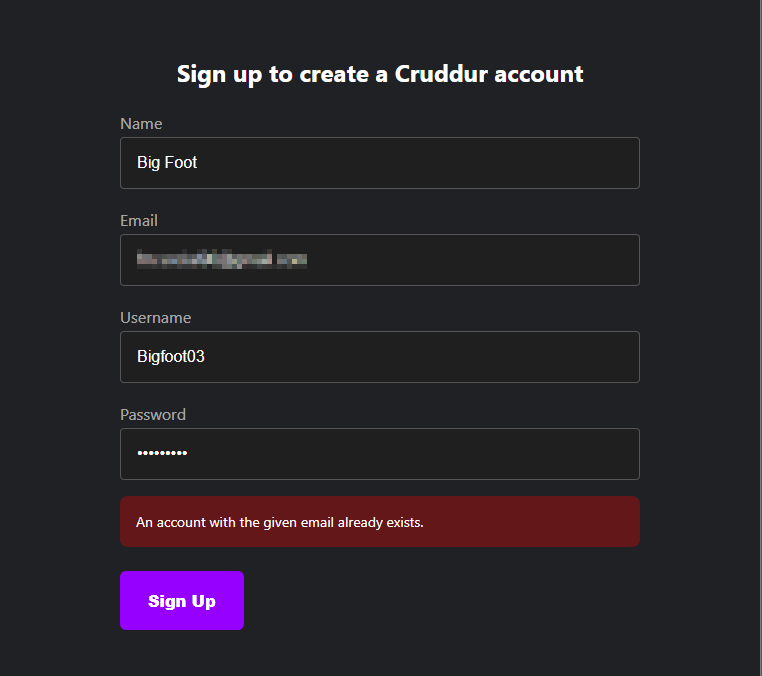
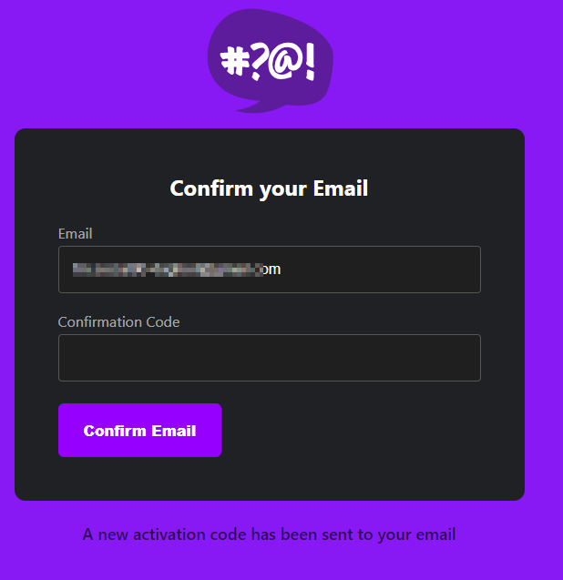
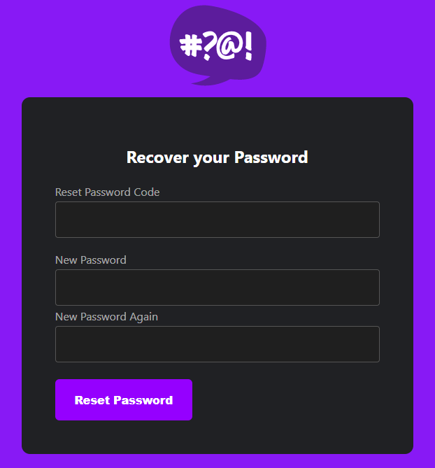
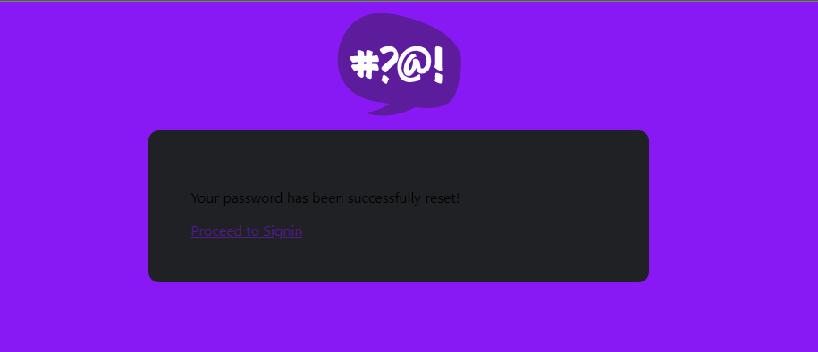
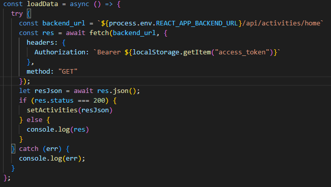
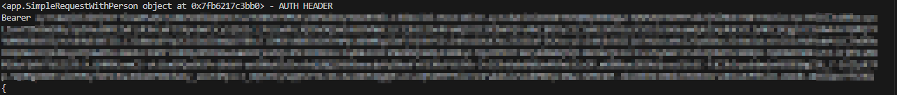

# Week 3 — Decentralized Authentication


## Required Homework

### Setup Cognito User Pool

This week we provisioned an AWS Cognito User Pool using clickOps and integrated it with the frontend of our app. To perform this we performed the following:

    - Set the required environment variables in docker-compose.yml
    - Import 'Auth' from aws-amplify in app.js, HomeFeedPage.js, and SigninPage.js
    - In app.js, passed environmanet variables to configure Amplify and Auth for our application
    - updated 'onsubmit' actions in the SigninPage.js file to integrate with Cognito.

##### Setting the required environement variables for frontend-react service in docker-compose.yml

```
  frontend-react-js:
    environment:
      REACT_APP_BACKEND_URL: "https://4567-${GITPOD_WORKSPACE_ID}.${GITPOD_WORKSPACE_CLUSTER_HOST}"
      # Cognito Env Vars
      REACT_APP_AWS_PROJECT_REGION: "${AWS_DEFAULT_REGION}"
      REACT_APP_AWS_COGNITO_REGION: "${AWS_DEFAULT_REGION}"
      REACT_APP_AWS_USER_POOLS_ID: "us-####-#-#########"
      REACT_APP_CLIENT_ID: "################"
```

##### Import 'Auth' from aws-amplify in app.js and pass env vars for configuration

```
import { Amplify } from 'aws-amplify';

Amplify.configure({
  "AWS_PROJECT_REGION": process.env.REACT_APP_AWS_PROJECT_REGION,
  "aws_cognito_region": process.env.REACT_APP_AWS_COGNITO_REGION,
  "aws_user_pools_id": process.env.REACT_APP_AWS_USER_POOLS_ID,
  "aws_user_pools_web_client_id": process.env.REACT_APP_CLIENT_ID,
  "oauth": {},
  Auth: {
    // We are not using an Identity Pool
    // identityPoolId: process.env.REACT_APP_IDENTITY_POOL_ID, // REQUIRED - Amazon Cognito Identity Pool ID
    region: process.env.REACT_APP_AWS_PROJECT_REGION,           // REQUIRED - Amazon Cognito Region
    userPoolId: process.env.REACT_APP_AWS_USER_POOLS_ID,         // OPTIONAL - Amazon Cognito User Pool ID
    userPoolWebClientId: process.env.REACT_APP_CLIENT_ID,   // OPTIONAL - Amazon Cognito Web Client ID (26-char alphanumeric string)
  }
})
```
##### Updated 'onsubmit' actions in the SigninPage.js file to integrate with Cognito

```
import { Auth } from 'aws-amplify';

  const onsubmit = async (event) => {
    setErrors('')
    event.preventDefault();
    Auth.signIn(email, password)
      .then(user => {
        console.log('user',user)
        localStorage.setItem("access_token", user.signInUserSession.accessToken.jwtToken)
        window.location.href = "/"
      })
      .catch(error => {
        if (error.code == 'UserNotConfirmedException') {
          window.location.href = "/confirm"
        }
        setErrors(error.message)
      });
    return false
  }
```

We created a user within our user pool using the AWs Console to test out our sign-in page. This was a roundabout method because we bypassed using the sign-up page. Upon creation, our user was in a state where we needed to update the password in order to successfully login with this user.

### Custom Sign-in page

Ran the following CLI command to force change the password due to the nature in which we created this user. 

```
aws cognito-idp admin-set-user-password --user-pool-id <user-pool-id> --username <username> --password <password> --permanent
```

Once the password was updated, I was able to login successfully into our application. I also went in and added a 'preferred_username' attribute to my user, so that the handle would be updated to reflect the proper user. 



Also successfully tested the sign out functionality.

### Custom Signup Page and Confirmation Page

I updated both the SignupPage.js and ConfirmationPage.js per Andrew's instructions. My initial attempt to sign up failed due to a configuration setting on the user pool, so I had to recreate selecting only 'email' as the desired user pool sign-in option.  Once completed, I attempted to sign up again. This time it was successful and I was redirected to the expected confirmation page. 

I verified that I received an email and entered in the confirmation code. Once verified, I validated that the user was created in my Cognito User Pool.





Finally, I confirmed that I could sign in and the home page appeared as expected.


I did some additional UX testing out of curiosity. First, I  attempted to sign up with a new user but used the same email. As expected it caused an error because an account with that email already existed. 



Next, I tested the 're-send confirmation code' functionality for posterity, and it proved to be successful. However, I noted two things: 1) You can only re-send the code one time and 2) it actually doesn't send the same code twice.



### Custom Recovery Page

By this point, the pattern for updating our custom pages (replacing default cookies) was set. Added the code, and began testing out the functionality. My test was successful, I received an email and proceeded to reset my password, and test the login. 






### JWT - Server-Side Verification

In order to truly understand what was needed to accomplish this task, I needed to do some research on JWTs and python object-oriented programing. 
I read through this blog <https://supertokens.com/blog/what-is-jwt> about JWT and learned a lot about what they are, how they are used and their pros/cons.  JSON Web Tokens are used to share information between 2 clients; they contain JSON objects known as claims that are hashed to ensure JSON contents cannot be altered by either a client or malicious party. From my understanding, once a user signed in with the proper credentials in Cognito, an access token was passed to our frontend and was initially stored locally. The HomeFeedPage.js integrates with our backend by sending an API to our configured backend URL. To configure server-side verification, we needed to pass the access token with this API call to our backend. This was accomplished by adding the following code to HomeFeedPage.js.

```
{
        headers: {
          Authorization: `Bearer ${localStorage.getItem("access_token")}`
        }
```

##### Resulting in the following code block:


How do we verify that the access_token was successfully sent in the header? How can we read the token in our backend-flask?

We updated `app.py` so that the Authorization request header would get passed to the API as well as added some additional logic surrounding CORS. Once added, refreshing the webpage displayed the AUTH HEADER and the value of the access token thus confirming that our backend was able to decode the incoming JWT. 
	


This access token is our JWT, and we needed to implement a way for our application to perform server-side verification of our token. 
To accomplish this, we grabbed code from <https://github.com/cgauge/Flask-AWSCognito>


