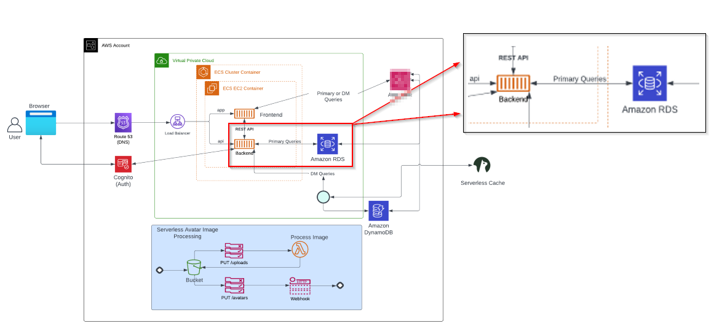

# Week 4 — Postgres and RDS

## Table of Contents
  - [Overview](#overview)
  - [Architectural Focus for the Week](#architectural-focus-for-the-week)
  - [Week 4 Videos](#week-4-videos)
  - [Required Homework](#required-homework)
  - [Create RDS Postgres Instance](#create-rds-postgres-instance)
  - [Bash Scripting for Common Database Actions](#bash-scripting-for-common-database-actions)
  - [Install Postgres Driver in Backend Application](#install-postgres-driver-in-backend-application)
  - [Connect Gitpod to RDS Instance](#connect-gitpod-to-rds-instance)
  - [Create new Activities with Database Insert](#create-new-activities-with-database-insert)

## Overview

### Architectural Focus for the Week

### Week 4 Videos
 - [Week 4 - Relational Databases]( https://www.youtube.com/watch?v=EtD7Kv5YCUs&list=PLBfufR7vyJJ7k25byhRXJldB5AiwgNnWv&index=47)
 - [SQL RDS]( https://www.youtube.com/watch?v=Sa2iB33sKFo&list=PLBfufR7vyJJ7k25byhRXJldB5AiwgNnWv&index=48)
 - [Cognito Post Confirmation Lambda]( https://www.youtube.com/watch?v=7qP4RcY2MwU&list=PLBfufR7vyJJ7k25byhRXJldB5AiwgNnWv&index=48) 
 - [Creating Activities]( https://www.youtube.com/watch?v=fTksxEQExL4&list=PLBfufR7vyJJ7k25byhRXJldB5AiwgNnWv&index=50)

[Bootcamp Class Notes and Tasks](https://github.com/omenking/aws-bootcamp-cruddur-2023/blob/week-4/journal/week4.md)

This week our goal was to implement production and development PostgreSQL servers and integrate it into our application. The production database was provisioned in RDS whereas the a container was spun up for our dev environment. Up until this point, the home page was populated with mock data and static values; with the introduction of the database layer, we could now create, update and delete information that would be served from and stored in the postgres databases. This introduced new complexities into the application included python-to-postgres communication requirements (via pyscopg driver), lambdas that automatically inserted new users into the database, and the implementation of the **'CRUD'** functionality.

## Required Homework

### Create RDS Postgres Instance

The production database was provisioned in the AWS Console using relatively basic settings. The idea was to select an instance type within the free tier among other parameter that would minimize spend. 

### Bash Scripting for Common Database Actions

Created several bash scripts to perform various database operations on both our local and prod PostgreSQL servers; scripts by default targeted the local postgres database unless the 'prod' parameter was entered. These operations included the following:
    
   - [Connect](https://github.com/fo-momoh/aws-bootcamp-cruddur-2023/blob/prod/bin/db/connect) - connects to prod or local database
   - [Create](https://github.com/fo-momoh/aws-bootcamp-cruddur-2023/blob/prod/bin/db/create) - creates cruddur database
   - [Drop](https://github.com/fo-momoh/aws-bootcamp-cruddur-2023/blob/prod/bin/db/drop) - drops cruddur database if there are no active connections
   - [Schema_load](https://github.com/fo-momoh/aws-bootcamp-cruddur-2023/blob/prod/bin/db/schema-load) - creates 2 tables and respective schemas in cruddur database: users and activities 
       * Calls upon the schema.sql file to create tables
   - [Seed](https://github.com/fo-momoh/aws-bootcamp-cruddur-2023/blob/prod/bin/db/seed) - loads mock data to cruddur database
       * Calls upon the seed.sql file to load data
   - [Sessions](https://github.com/fo-momoh/aws-bootcamp-cruddur-2023/blob/prod/bin/db/sessions) - returns table of active, idle and closed connections
   - [Setup](https://github.com/fo-momoh/aws-bootcamp-cruddur-2023/blob/prod/bin/db/setup) - utility script that automates the creation of the cruddur databases and loading of seed data. The script runs through the following bash scripts in this order:
       * drop
       * create
       * schema_load
       * seed
 
These scripts are useful for initiating the development postgres database, troubleshooting health with connectivity checks, and troubleshooting/data validation. 
 
### Install Postgres Driver in Backend Application 

Psycopg is the driver needed to allow python to interact with postgres. Leveraging the psycopg documentation, we were able to create a db.py file that houses our db class which was composed of various attributes and methods to make connections to our database(s), run queries, and format query output into json. <Add a little more context about how backend-flask leverages db.py>

### Connect Gitpod to RDS Instance

The `connect` script is written to accept an argument that toggles which database is target for connections. in order for this to function as expected, the `$PROD_CONNECTION_URL` environment variable had to be set to the connection string for the RDS endpoint. The initial attempt to connect the production database failed due to timeout.

	
Updated SG for RDS instance to allow inbound traffic from the IP address of our gitpod environment. When the Gitpod workspace is restarted, it's assigned a new IP address. In order to automatically update the SG with each restart of our workspace, we created the `rds-update-sg-rule bash script`. This script ran a command that returned the IP of the gitpod workspace and stored it in the $GITPOD_IP variable, and then ran AWS CLI commands to update the security group using hardcoded security group ID and the specific security rule ID. I configured the script to be ran as part of the initialization of the workspace by updating he gitpod.yml file. Now each time a workspace is started, the security group rule is updated accordingly and our db-ops bash scripts function normally. 

### Cognito Lambda Trigger

### Create new Activities with Database Insert

Purpose: Implement a `create_activity` function that will allow us to create a 'crud', insert it into the database, and retrieve it on our homepage.
